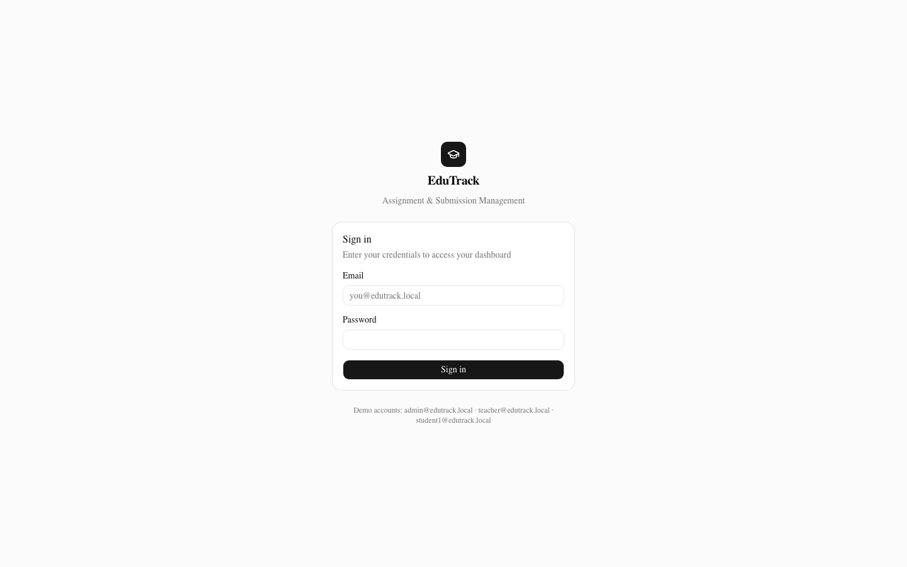
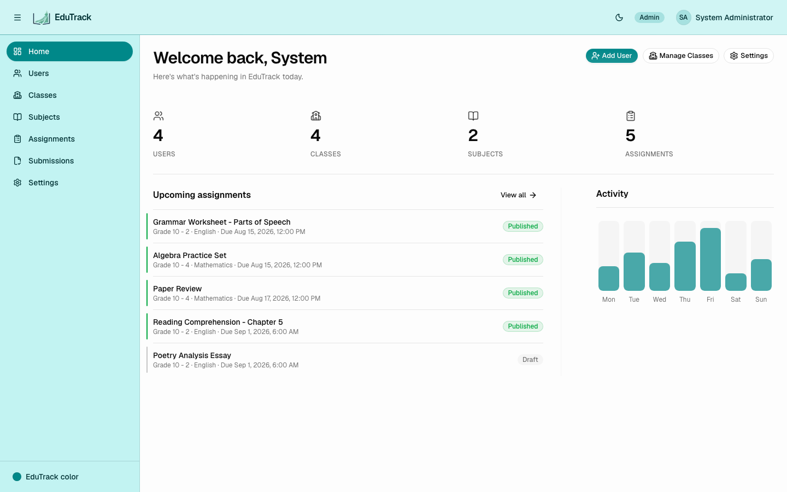
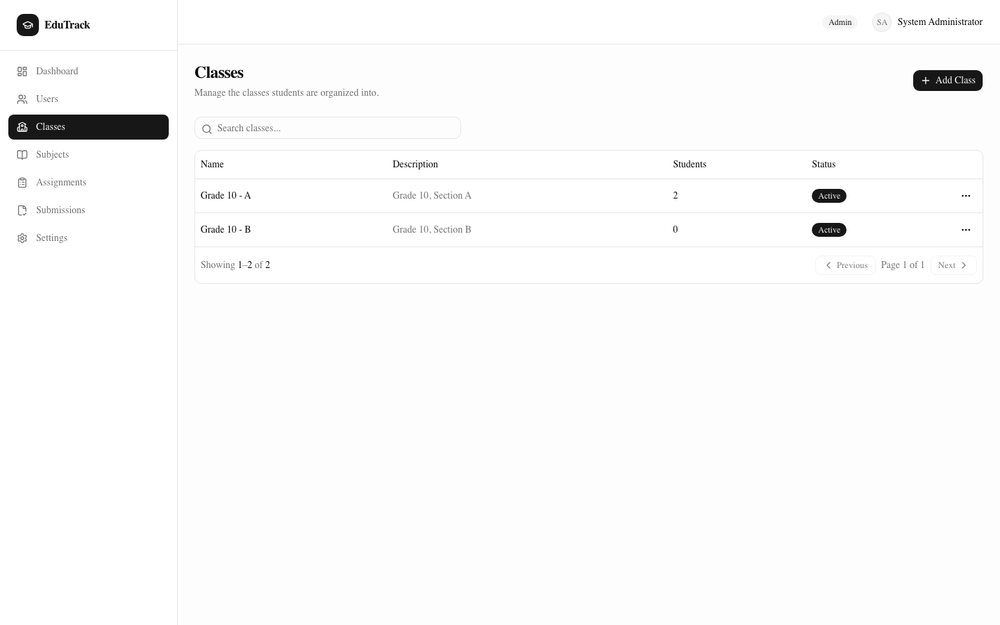
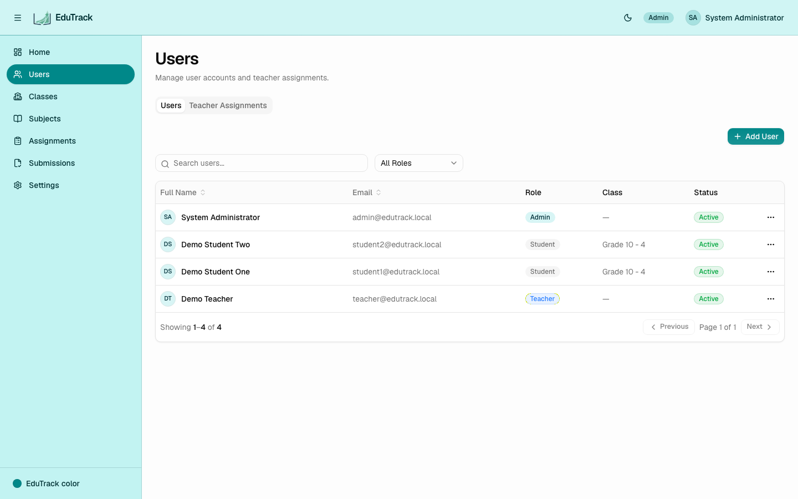
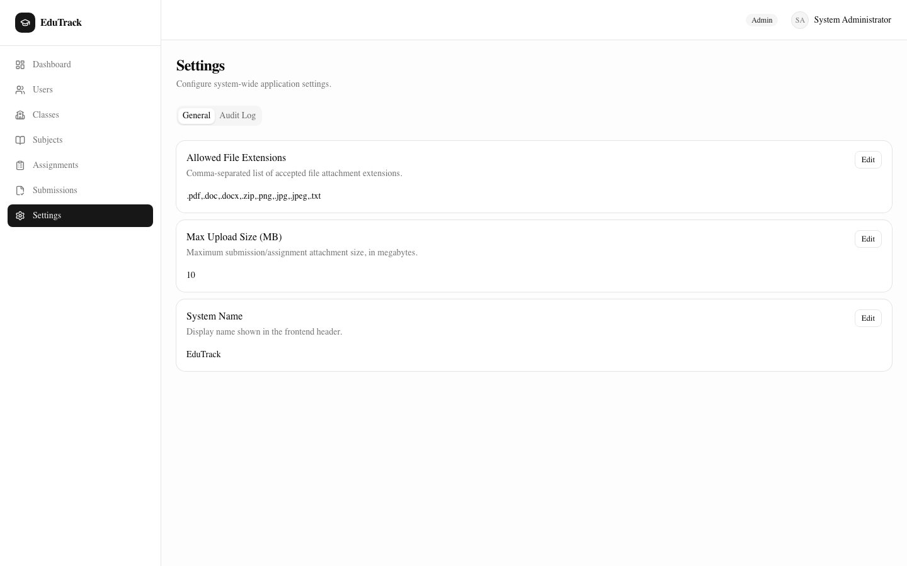
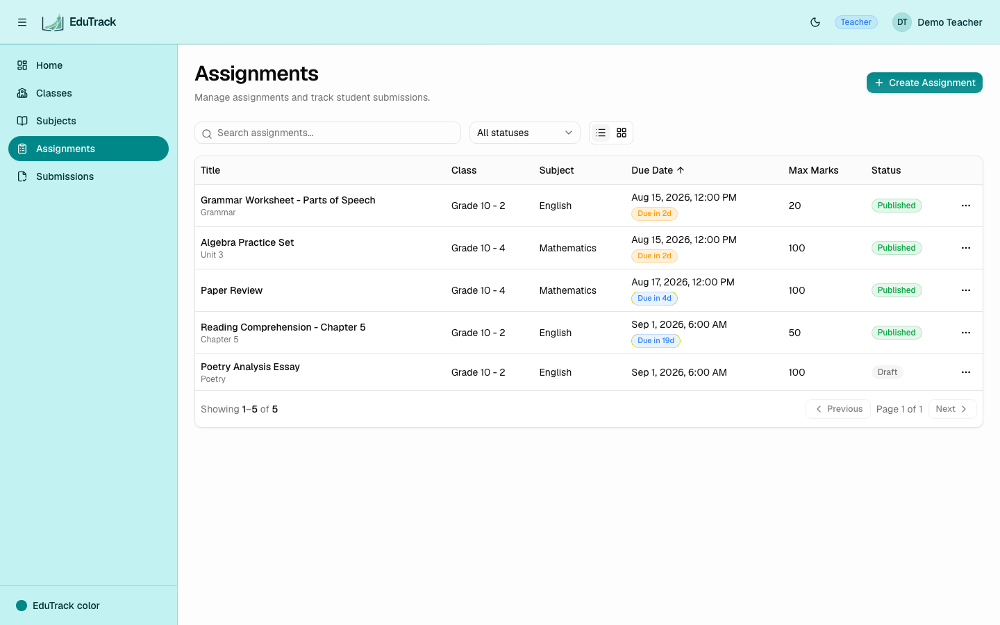

# EduTrack — Assignment & Submission Management System

A production-quality Assignment & Submission Management System built as a recruitment take-home assignment, per `Claude_Code_Master_Prompt_Assignment_System.md`. Admins manage the organization (users, classes, subjects, teacher assignments); Teachers create and grade assignments for the classes/subjects they're assigned to; Students submit work and view their marks and feedback.

## Overview

- **Backend**: ASP.NET Core 9 Web API, Clean Architecture (Domain / Application / Infrastructure / Persistence / Api), EF Core + PostgreSQL, JWT + refresh-token auth, RBAC, Serilog, Swagger.
- **Frontend**: Next.js 15 (App Router) + TypeScript + Tailwind CSS v4 + shadcn/ui (Radix), React Hook Form + Zod, TanStack Query, Axios, Framer Motion.
- **Infra**: Docker Compose (Postgres, RustFS object storage, backend, frontend, Nginx reverse proxy).

Full requirement analysis, architecture, database design, and API design were produced and approved before implementation — see `docs/architecture/architecture.md` and `docs/diagrams/er-diagram.md`.

## Screenshots

| Login | Admin Dashboard | Classes |
|---|---|---|
|  |  |  |

| Users & Teacher Assignments | Settings | Teacher — Assignments |
|---|---|---|
|  |  |  |

## Architecture

See [`docs/architecture/architecture.md`](docs/architecture/architecture.md) for the system context, backend layering, frontend structure, and deployment diagrams, and [`docs/diagrams/er-diagram.md`](docs/diagrams/er-diagram.md) for the full entity-relationship diagram and schema constraints.

## Project Structure

```text
/
├── backend/            ASP.NET Core 9 Web API (Clean Architecture)
├── frontend/           Next.js 15 App Router frontend
├── docker/             Nginx config, Postgres notes, dev scripts
├── docs/               Architecture, ER diagram, API notes
├── docker-compose.yml
├── .env.example
└── README.md
```

## Quick Start (Docker — recommended)

This is the fastest way to see the whole system running; it needs nothing installed except Docker (and Docker Compose, which ships with Docker Desktop).

```bash
git clone https://github.com/hasan-sakib/EduTrack
cd EduTrack

cp .env.example .env
# Edit .env and set two secrets — there are no safe defaults for these:
#   JWT_SECRET_KEY     -> openssl rand -base64 48
#   RUSTFS_SECRET_KEY  -> openssl rand -base64 48

docker compose up -d --build
```

Wait for the containers to report healthy/started (`docker compose ps`), then open **http://localhost:8080** — Nginx serves the frontend at `/`, proxies `/api/*` to the backend, and `/swagger` to the API docs, all on that one port. Migrations and seed data are applied automatically on backend startup, so the app is immediately usable with the demo accounts below.

To follow logs while it starts up: `docker compose logs -f backend frontend`.

To stop the stack: `docker compose down` (add `-v` to also wipe the Postgres/RustFS volumes and start completely fresh next time).

### Demo accounts (seeded)

| Role    | Email                     | Password    |
|---------|---------------------------|-------------|
| Admin   | admin@edutrack.local      | Admin@123   |
| Teacher | teacher@edutrack.local    | Teacher@123 |
| Student | student1@edutrack.local   | Student@123 |
| Student | student2@edutrack.local   | Student@123 |

The demo teacher is pre-assigned to teach Mathematics to "Grade 10 - A" (both demo students' class).

## Environment Variables

Set in `.env` at the repo root for Docker Compose (see `.env.example` for the full list with defaults):

| Variable | Purpose |
|---|---|
| `POSTGRES_DB` / `POSTGRES_USER` / `POSTGRES_PASSWORD` | Postgres credentials |
| `JWT_SECRET_KEY` | HMAC signing key for access tokens — **must** be overridden in `.env`, no safe default is shipped |
| `JWT_ISSUER` / `JWT_AUDIENCE` | JWT issuer/audience claims |
| `APP_ORIGIN` | Public origin used for the backend's CORS allow-list |
| `APP_PORT` | Host port Nginx publishes on — the whole app (frontend + API + Swagger) is reachable here |
| `RUSTFS_ACCESS_KEY` | Access key for the RustFS (S3-compatible) object store used for assignment/submission file uploads |
| `RUSTFS_SECRET_KEY` | Secret key for RustFS — **must** be overridden in `.env`, no safe default is shipped |
| `RUSTFS_BUCKET_NAME` | Bucket the backend uploads files into; created automatically on first upload if it doesn't exist |
| `RUSTFS_API_PORT` / `RUSTFS_CONSOLE_PORT` | Host ports for RustFS's S3 API and web console — only needed if you want to browse uploaded files directly at `http://localhost:9001`; the backend always talks to RustFS over the internal Docker network regardless |

For running the backend/frontend outside Docker, see `backend/src/EduTrack.Api/appsettings.json` and `frontend/.env.example` respectively.

## Running Without Docker

This gets you hot-reload on the backend and frontend while still running Postgres and RustFS as containers — the recommended setup for active development. Running Postgres/RustFS natively instead is also fine; only the connection settings below need to point at them.

### 0. Start the infra dependencies

```bash
cp .env.example .env   # if you haven't already; set JWT_SECRET_KEY and RUSTFS_SECRET_KEY
docker compose up -d postgres rustfs
```

This starts just Postgres (`localhost:5432`) and RustFS (S3 API on `localhost:9000`, console on `localhost:9001`), matching the defaults already in `appsettings.json`.

### 1. Backend

Requires the **.NET 9 SDK**.

```bash
cd backend
dotnet restore

# appsettings.json already points at localhost:5432 (Postgres) and localhost:9000 (RustFS) with the
# repo's default dev credentials, so this works out of the box against step 0. To override anything
# (e.g. a different RustFS secret key), use appsettings.Development.json or `dotnet user-secrets`
# rather than editing appsettings.json directly.
dotnet ef database update --project src/EduTrack.Persistence --startup-project src/EduTrack.Api
dotnet run --project src/EduTrack.Api
```

The API listens on the URL printed at startup (Swagger UI at `/swagger`). Migrations and seed data also apply automatically at every startup regardless — the explicit `dotnet ef database update` above is only needed if you want to apply them without starting the API. The RustFS upload bucket (`RUSTFS_BUCKET_NAME` / `edutrack-uploads` by default) is created automatically on first file upload.

### 2. Frontend

Requires **Node.js 20+**.

```bash
cd frontend
cp .env.example .env.local   # set NEXT_PUBLIC_API_URL to your running backend, e.g. http://localhost:5216/api/v1
npm install
npm run dev
```

Open http://localhost:3000.

## Migrations

Migrations live in `backend/src/EduTrack.Persistence/Migrations/`. To add a new one after changing an entity or `IEntityTypeConfiguration`:

```bash
cd backend
dotnet ef migrations add <Name> --project src/EduTrack.Persistence --startup-project src/EduTrack.Api -o Migrations
```

They're applied automatically on API startup (`Program.cs` calls `Database.MigrateAsync()` for the Postgres provider).

## Seed Data

`EduTrack.Persistence/Seed/DbSeeder.cs` runs on every startup and is idempotent (checks for existing rows before inserting):

- The three `Roles` (Admin, Teacher, Student).
- One Admin user (see demo accounts above).
- Demo data for local development: two Classes, two Subjects, one Teacher, two Students, and one TeacherAssignment linking them.
- Three `ApplicationSettings` rows (`SystemName`, `MaxUploadSizeMB`, `AllowedFileExtensions`) that drive the file-upload validation on `POST /api/v1/files/upload`.

## Tests

```bash
cd backend
dotnet test
```

- `tests/EduTrack.UnitTests` — xUnit + FluentAssertions against the Application-layer services, using EF Core's InMemory provider. Covers the business rules that matter most: deadline enforcement, resubmission rules, RBAC scoping (Admin/Teacher/Student see different assignment sets), ownership checks, and marks-cannot-exceed-max-marks.
- `tests/EduTrack.IntegrationTests` — boots the real ASP.NET Core pipeline via `WebApplicationFactory<Program>` (auth, middleware, controllers) against an isolated in-memory database, covering the login flow, 401/403 enforcement, and `/auth/me`.

## Docker

All infrastructure config lives under `docker/`; the root only has `docker-compose.yml` and `.env.example`, per the project's structure convention.

- `docker/nginx/nginx.conf` — reverse proxy: `/` → frontend, `/api/*` and `/swagger` → backend.
- `docker/postgres/` — no init scripts needed (EF Core migrations own the schema); documents that.
- `docker/scripts/reset-db.sh` — wipes the local Postgres volume and restarts the stack, for a clean local demo.

## Troubleshooting

- **502 Bad Gateway right after rebuilding one service** (e.g. `docker compose up -d --build backend`): Nginx resolves the `backend`/`frontend` upstream container IPs once, at its own startup, and doesn't notice when Docker recreates those containers with new IPs. Fix: `docker restart edutrack-nginx-1` (or `docker compose restart nginx`) after rebuilding an individual service. A full `docker compose up -d --build` (all services) doesn't need this, since Nginx restarts too.
- **`JWT_SECRET_KEY must be set` / `RUSTFS_SECRET_KEY must be set` on startup**: these two have no default — copy `.env.example` to `.env` and fill them in (`openssl rand -base64 48` for each) before running `docker compose up`.
- **File uploads fail outside Docker**: the backend needs RustFS reachable at `Storage:ServiceUrl` (`http://localhost:9000` by default) — run `docker compose up -d rustfs` (see "Running Without Docker" above) or point `Storage:ServiceUrl`/`AccessKey`/`SecretKey` at wherever your S3-compatible store actually is.
- **Clean-slate demo**: `./docker/scripts/reset-db.sh` wipes the Postgres volume and restarts the stack so migrations + seed data re-run from scratch. It leaves the RustFS volume alone; add `docker compose down -v` first if you also want previously-uploaded files gone.

## Assumptions

The master prompt's database/business-rule sections left some points ambiguous. Resolutions (see the approved plan in `docs/architecture/architecture.md` for full rationale):

1. **Student ↔ Class**: no `Enrollments` table was specified, so a Student belongs to exactly one `Class` via a nullable `ClassId` on `Users`.
2. **Assignment ↔ Teacher/Class/Subject**: an `Assignment` references a `TeacherAssignments` row (not raw FKs), so it's always provably scoped to a real (teacher, class, subject) grant.
3. **Resubmission**: gated by an assignment-level `AllowResubmission` flag, only while `Status = Published` and before `DueDate`; a submission that's already been graded can no longer be resubmitted.
4. **Submission content**: both a text `Content` field and multiple optional file attachments are supported, backed by RustFS (an S3-compatible object store) rather than local disk, so file storage isn't tied to a single backend container's filesystem.
5. **ApplicationSettings**: used for `SystemName`, `MaxUploadSizeMB`, and `AllowedFileExtensions` — Admin-editable via Settings → General.
6. **AuditLogs**: written on create/update/delete of Users/Classes/Subjects/TeacherAssignments/Assignments, grading actions, and auth events (login/refresh/logout); read-only, Admin-only, surfaced under Settings → Audit Log.
7. **Soft delete**: Users/Classes/Subjects are soft-deleted (`IsActive = false`) to preserve grading/audit history; TeacherAssignments are hard-deleted but blocked if Assignments already exist under them.
8. **Token lifetimes**: 15-minute access tokens, 7-day rotating refresh tokens (hashed at rest, revocable).
9. **Auth token storage**: the frontend stores tokens in `localStorage` (read by the Axios client) and mirrors the access token into a plain cookie so Next.js middleware can gate routes without a full BFF/proxy layer — see Known Limitations.

## Known Limitations

- **Token storage trade-off**: access/refresh tokens are stored in `localStorage` and a non-`httpOnly` cookie rather than behind a server-side BFF, trading some XSS resistance for avoiding a full proxy layer. Mitigated by short-lived (15 min) access tokens and the fact that the API independently re-enforces RBAC regardless of client state.
- **Marks ≤ MaxMarks** is enforced in the Application layer, not as a database check constraint (EF Core can't portably express a cross-table check constraint).
- **Submissions list** is always scoped to one assignment at a time (no cross-assignment "all my submissions" endpoint for Students) — students view their submission status per-assignment on the assignment detail page instead of a dedicated top-level list.
- `npm audit` reports 3 high-severity advisories in `postcss`/`sharp`, both transitive dependencies bundled inside Next.js 15.5.x itself. The fix requires upgrading to Next.js 16, which would conflict with the master prompt's explicit "Next.js 15" requirement — not exploitable via this app's own attack surface (no untrusted image processing or arbitrary user-controlled CSS).
- Swagger UI is left enabled unconditionally (not gated to Development) for easier grading/demo access to the API surface.
