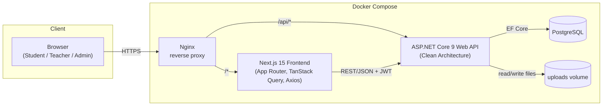
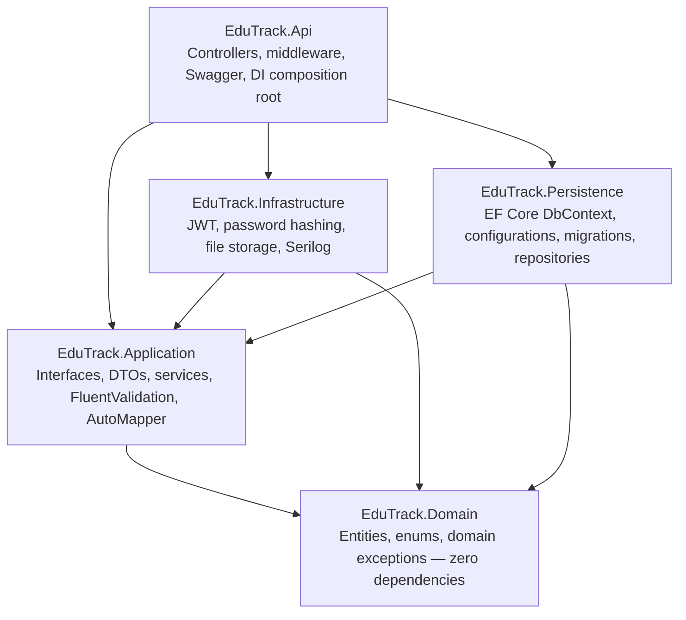
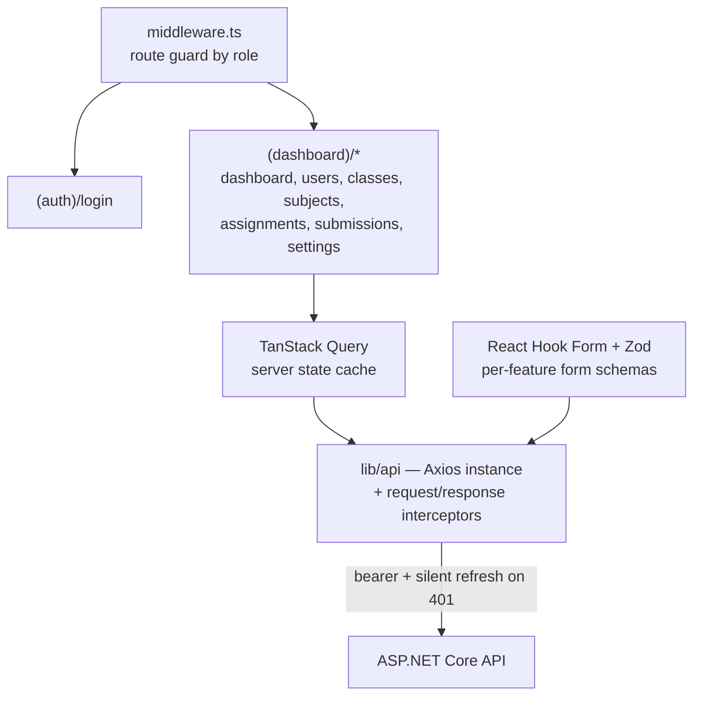
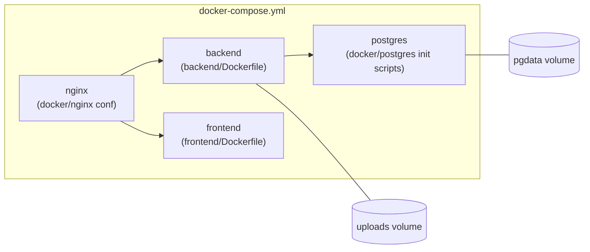

# Architecture

## System Context

Next.js talks to the API exclusively over `/api/v1`; Nginx routes browser traffic to either the frontend or backend container based on path, so the app is reachable on a single public port. Uploaded submission files are written to a named Docker volume and are only ever served back through an authenticated backend endpoint — never mounted as static/public files.

## Backend — Clean Architecture

Five projects, strict inward dependency direction (API → Application/Persistence/Infrastructure → Domain; nothing depends outward on API):

**Domain** has no NuGet dependencies beyond the BCL — it defines what a `User`, `Assignment`, `Submission`, etc. *are*, plus enums (`AssignmentStatus`, `SubmissionStatus`) and domain-level exceptions (e.g. `DeadlinePassedException`, `MarksExceedMaxException`).

**Application** defines the ports (`IUserService`, `IAssignmentService`, `ISubmissionService`, `ITeacherAssignmentService`, `IAuthService`, `ICurrentUserService`, `IFileStorageService`, `IUnitOfWork`, `IRepository<T>`) and the request/response DTOs that cross the API boundary. Business rules that don't belong to a single entity (e.g. "a student can only submit to a Published assignment for their own class, before the deadline") live in service implementations here, not in controllers. FluentValidation validators and AutoMapper profiles are colocated per feature.

**Infrastructure** implements the technical adapters that Application depends on as interfaces: JWT issuance/validation (`IAuthService`), local-disk file storage (`IFileStorageService`), password hashing, and Serilog sink configuration.

**Persistence** implements `AppDbContext` (EF Core), Fluent API entity configurations carrying constraints/indexes, the generic repository + unit-of-work, migrations, and seed data (roles, a bootstrap Admin, demo classes/subjects for local dev).

**Api** is the composition root: thin controllers that map HTTP ↔ DTOs and call into Application services, `[Authorize(Roles=...)]` plus a custom resource-authorization requirement/handler for ownership checks (a teacher may only touch assignments under their own `TeacherAssignments`; a student may only touch their own submissions), a global exception-handling middleware that converts domain/validation exceptions into RFC7807 `ProblemDetails`, Serilog request logging, and Swagger with a JWT bearer security scheme.

### Cross-cutting concerns

- **Pagination & filtering**: every list endpoint accepts a shared `PagedQuery` (page, pageSize, search, sortBy, sortDir) and returns `PagedResult<T>`. Implemented once in Application as a reusable extension over `IQueryable<T>`, not duplicated per feature.
- **Validation**: FluentValidation validators run automatically via the MVC pipeline (`AddFluentValidationAutoValidation`); invalid requests short-circuit to a 400 `ProblemDetails` before hitting a controller action.
- **Exception handling**: a single `ExceptionHandlingMiddleware` maps `ValidationException` → 400, `NotFoundException` → 404, `ForbiddenException`/RBAC failures → 403, everything else → 500 with a logged correlation ID and a generic body (no stack traces leaked to clients).
- **Auditing**: a lightweight `IAuditLogger` is called from service methods that mutate state (create/update/delete on Users/Classes/Subjects/TeacherAssignments/Assignments, grading, and auth events), writing to `AuditLogs` without adding a cross-cutting EF Core interceptor (kept explicit and easy to trace, rather than "magic").

## Frontend — Next.js 15 App Router

- `middleware.ts` reads the access-token/session state on every request to a protected route and redirects unauthenticated users to `/login`, and unauthorized-role users to a `403` page.
- The Axios instance centralizes the bearer token attach + a single-flight silent-refresh-on-401 flow (queues concurrent requests during refresh, replays them after).
- Every list/detail view is a TanStack Query hook (`useUsersQuery`, `useAssignmentsQuery`, …) with query-key-based cache invalidation on mutation.
- Every form pairs a Zod schema (mirroring the backend FluentValidation rules) with React Hook Form's resolver, so client-side errors match server-side ones.
- Role-aware navigation reads the decoded role claim (from `/auth/me`) to show/hide nav items — the guard itself still lives server-side via middleware + API RBAC, this is purely UX.

## Deployment (Docker)

`docker/scripts` holds a wait-for-postgres entrypoint wrapper so the backend container retries DB connections until Postgres is ready, then applies pending EF Core migrations and seed data automatically on startup (dev/demo convenience — documented as a `README.md` assumption).
