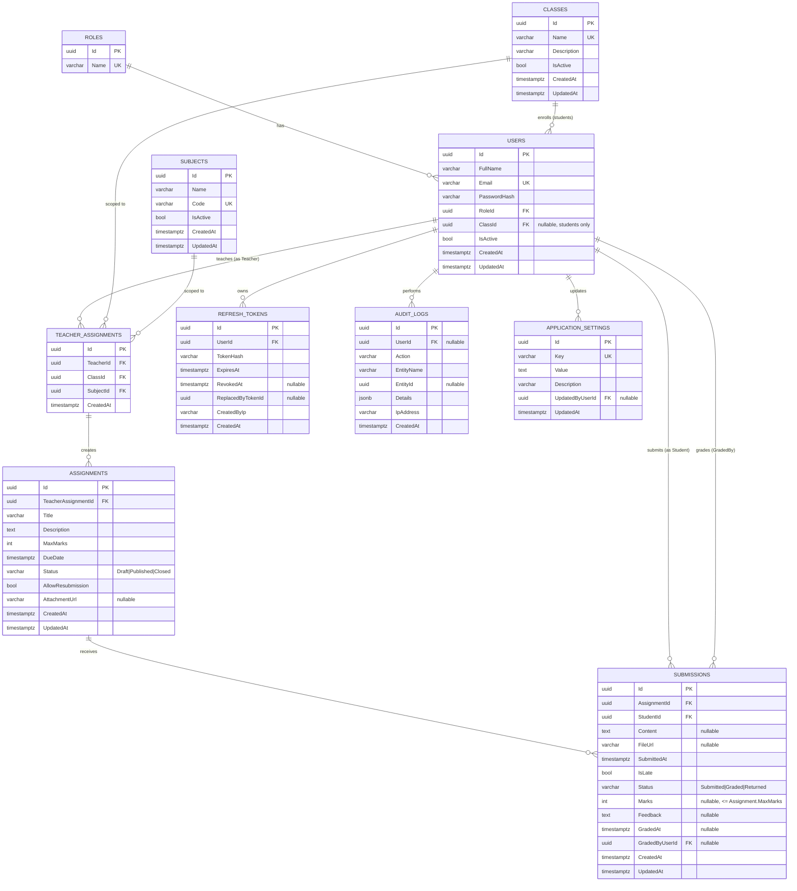

# Entity-Relationship Diagram

PostgreSQL, UUID primary keys, `CreatedAt`/`UpdatedAt` timestamptz on every table. See `docs/architecture/architecture.md` for the system/backend/frontend architecture and `Claude_Code_Master_Prompt_Assignment_System.md` §Database for the source requirement. Ambiguity resolutions are documented in the approved plan and will be carried into `README.md` → Assumptions.

## Key constraints & indexes

- `Users.Email` unique; `Users(RoleId)`, `Users(ClassId)` indexed.
- `TeacherAssignments` unique composite `(TeacherId, ClassId, SubjectId)`.
- `Assignments(TeacherAssignmentId, Status, DueDate)` composite index for list filtering.
- `Submissions` unique composite `(AssignmentId, StudentId)` — one row per student per assignment; edits update the same row while allowed. Indexed on `StudentId`.
- `Submissions.Marks <= Assignments.MaxMarks` is enforced in the Application layer (cross-table check constraints aren't portably expressible in EF Core), not as a DB check constraint. Documented as a known limitation in `README.md`.
- `AuditLogs.Details` is a plain `text` column (free-text description of the change), not `jsonb` — the audit logger only ever writes short human-readable strings, not structured JSON payloads.
- FK delete behavior: `Restrict` on `Classes→Users`, `Subjects/Classes→TeacherAssignments`, `TeacherAssignments→Assignments`, `Assignments→Submissions`. Parents with dependents are soft-deleted (`IsActive = false`) instead of hard-deleted.
